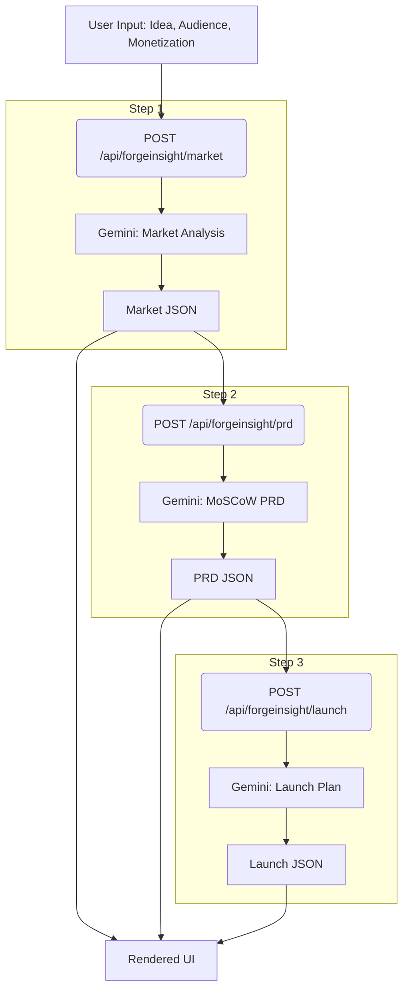
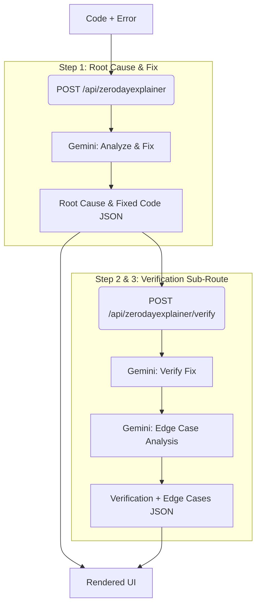
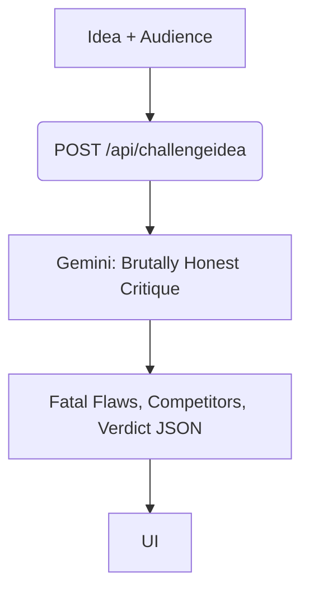

# Architecture & Design

This document outlines the architectural decisions, pipeline designs, and data flow of ForgeLabs.

## System Architecture Overview

ForgeLabs uses a modern Next.js App Router architecture, focusing on server-side validation and autonomous AI pipelines.

### Core Stack
- **Frontend/Backend:** Next.js 16 (App Router)
- **Styling:** Vanilla CSS + Tailwind CSS utilities + Framer Motion
- **Database & Auth:** Supabase (PostgreSQL, Row Level Security, JWTs)
- **AI Models:** Google Gemini 2.5 Flash (via `@google/genai` or direct REST fetch)
- **Schema Validation:** Zod

## Authentication & Security

All API routes use a secure token-based authentication approach.

**Crucial Security Decision:**
We explicitly avoid `supabase.auth.getSession()` on the server because it relies on potentially spoofable cookies. Instead, the client sends the `access_token` in the `Authorization: Bearer <token>` header, and the server validates it using `supabase.auth.getUser(accessToken)`. This guarantees cryptographic verification of the user making the request.

## The BYOK (Bring Your Own Key) Engine

To balance a freemium model with unlimited scaling, we use a hybrid credit system:
1. **Free Tier:** Users get 3 free pipeline runs (tracked in the `tool_usage` table). We use the server's `GEMINI_API_KEY`.
2. **BYOK Mode:** Users enter their own Gemini API key in the Setup page. It is stored securely in `localStorage` and sent via the `x-user-key` header. If present, the server bypasses the credit check and uses the user's key directly against Google's API.

## Autonomous AI Pipelines

ForgeLabs is built around the concept of autonomous multi-step pipelines. Instead of a single massive prompt (which degrades reasoning quality), we chain smaller, focused prompts together. The output of Step 1 is passed directly as context to Step 2, and so on.

### 1. ForgeInsight Pipeline (Product Research)
A 3-step pipeline to generate a comprehensive product plan.

### 2. Zero-Day Explainer Pipeline (Iterative Debugging)
A self-healing 3-step pipeline that generates a fix, then critically verifies its own fix.

### 3. Challenge My Idea (Contrarian Agent)
A single-step, high-density reasoning pipeline. The system prompt is heavily engineered to bypass standard AI sycophancy (agreeableness) and forcefully critique the input.

## Database Schema

- `projects`: Organizes all runs. Has `id`, `user_id`, `name`, `description`, `status`.
- `tool_usage`: Audit log for the credit system. Has `id`, `user_id`, `tool_id`, `key_source` (server vs user), `data` (JSONB of the inputs/outputs).

## Future Considerations
- Transitioning to a multi-model architecture to use Gemini for speed (Step 1) and Claude 3.5 Sonnet or GPT-4o for complex reasoning (Step 2/3).
- Adding background web search (e.g., Tavily API) to Step 1 of ForgeInsight for real-time competitor data.
